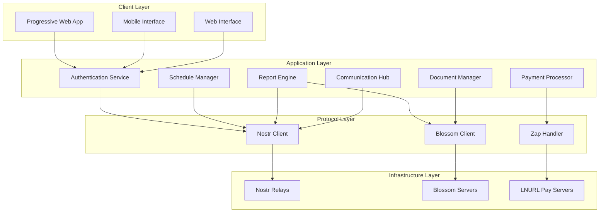
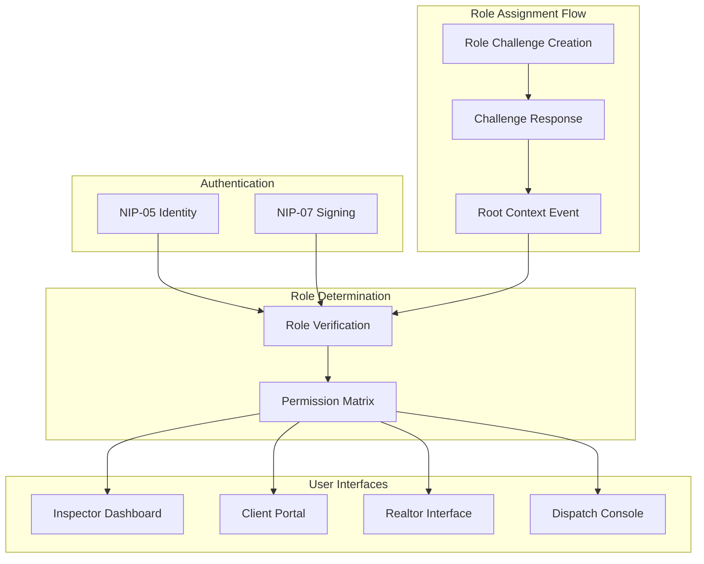
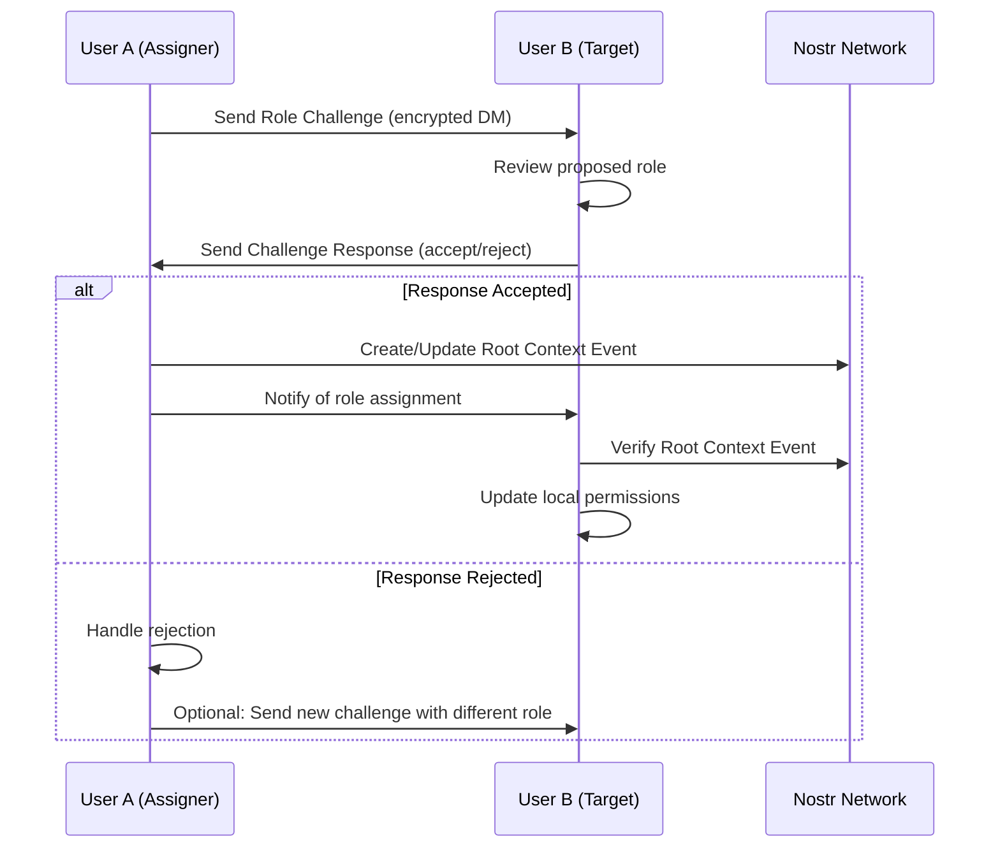

# Design Document

## Overview

The Nostr-native home inspection management platform is designed as a decentralized, multi-role system that replaces traditional SaaS solutions with a secure, client-controlled alternative. The platform supports four distinct user roles (Home Inspector, Client, Realtor, Dispatch) with role-based access controls and focuses on efficient business management including scheduling, reporting, payments, and CRM functionality. Each instance is primarily designed to enable Inspector and Dispatch operations, with NIP-05 identity verification restricted to these administrative roles.

The system leverages Nostr protocol for identity management and data storage, Blossom servers for media files, Lightning Network for payments, and implements a Progressive Web App using the PurpleStack template for cross-platform compatibility.

## Architecture

### High-Level Architecture



### Role-Based Access Architecture



### Role Assignment Workflow



## Components and Interfaces

### Core Components

#### 1. Authentication Service
- **Purpose**: Handle decentralized identity verification and role-based access
- **Key Features**:
  - NIP-05 identity verification (Inspector and Dispatch only)
  - NIP-07 browser extension integration for all users
  - Role assignment through challenge-response system
  - Root context event creation and management
  - Session management with cryptographic signatures

#### 2. Schedule Manager
- **Purpose**: Manage inspection scheduling with mapping and conflict resolution
- **Key Features**:
  - Calendar interface with map integration
  - Conflict detection and prevention
  - Multi-inspector assignment
  - Location geocoding and plotting

#### 3. Report Engine
- **Purpose**: Create, edit, and manage inspection reports
- **Key Features**:
  - Template-based report generation
  - Real-time collaborative editing
  - Photo/media integration with Blossom
  - Version control and approval workflows

#### 4. Payment Processor
- **Purpose**: Handle invoicing, payments, and financial tracking using Nostr zaps
- **Key Features**:
  - Nostr zap integration (NIP-57)
  - Zap request/receipt handling
  - Automated payment tracking
  - Financial reporting and analytics

#### 5. Communication Hub
- **Purpose**: Manage encrypted messaging between all parties
- **Key Features**:
  - Unified inbox for Inspectors/Dispatch
  - Role-based message routing
  - File sharing via Blossom
  - Phone integration for urgent communications

#### 6. Document Manager
- **Purpose**: Handle agreement documents and contract management
- **Key Features**:
  - Template management and versioning
  - Digital signature capture
  - Document delivery tracking
  - Audit trail maintenance

### Interface Specifications

#### Authentication Interface
```typescript
interface AuthService {
  verifyNIP05(identifier: string, requiredRole: 'inspector' | 'dispatch'): Promise<boolean>
  requestSignature(challenge: string): Promise<string>
  createRoleAssignmentChallenge(targetPubkey: string, role: UserRole): Promise<RoleChallenge>
  respondToRoleChallenge(challenge: RoleChallenge, acceptance: boolean): Promise<RoleResponse>
  createRootContextEvent(roleAssignments: RoleAssignment[]): Promise<RootContextEvent>
  determineRole(pubkey: string, contextEventId: string): Promise<UserRole>
  createSession(pubkey: string, role: UserRole, contextId: string): Promise<Session>
}

enum UserRole {
  INSPECTOR = 'inspector',
  CLIENT = 'client', 
  REALTOR = 'realtor',
  DISPATCH = 'dispatch'
}

interface RoleChallenge {
  id: string
  challengerPubkey: string
  targetPubkey: string
  proposedRole: UserRole
  challenge: string
  expiresAt: Date
}

interface RoleResponse {
  challengeId: string
  accepted: boolean
  signature: string
  timestamp: Date
}

interface RoleAssignment {
  pubkey: string
  role: UserRole
  assignedBy: string
  confirmedAt: Date
}

interface RootContextEvent {
  kind: 30200 // Custom kind for root context
  content: string // encrypted role assignments
  tags: [
    ['d', string], // context identifier
    ['participants', ...string[]], // all participant pubkeys
    ['created_by', string] // creator pubkey
  ]
}
```

#### Schedule Management Interface
```typescript
interface ScheduleManager {
  getAvailableSlots(inspectorId: string, date: Date): Promise<TimeSlot[]>
  scheduleInspection(details: InspectionDetails): Promise<Inspection>
  getInspectionsByDate(date: Date): Promise<Inspection[]>
  plotLocationsOnMap(inspections: Inspection[]): Promise<MapView>
  checkConflicts(inspection: InspectionDetails): Promise<Conflict[]>
}

interface InspectionDetails {
  propertyAddress: string
  coordinates: GeoCoordinates
  clientId: string
  inspectorId: string
  scheduledTime: Date
  inspectionType: string
}
```

#### Report Management Interface
```typescript
interface ReportEngine {
  createReport(inspectionId: string): Promise<Report>
  updateReport(reportId: string, updates: ReportUpdate): Promise<Report>
  uploadMedia(file: File): Promise<BlossomHash>
  generatePDF(reportId: string): Promise<Blob>
  shareReport(reportId: string, recipients: string[]): Promise<ShareLink>
}

interface Report {
  id: string
  inspectionId: string
  status: ReportStatus
  findings: Finding[]
  media: BlossomHash[]
  createdBy: string
  lastModified: Date
}
```

## Root Context System

The root context system establishes a decentralized authority structure where users can assign roles to each other through cryptographic challenges and responses. This creates a web of trust that doesn't rely on centralized role management.

### Context Establishment Process

1. **Initial Setup**: A user (typically Dispatch) creates a new business context
2. **Role Assignment**: The context creator sends role challenges to other users
3. **Challenge Response**: Target users accept or reject proposed roles
4. **Root Event Creation**: Accepted role assignments are recorded in a root context event
5. **Reference System**: All subsequent events reference this root context for permission validation

### Permission Inheritance

- **Root Context Event**: Contains the authoritative role assignments
- **Event Validation**: All business events must reference a valid root context
- **Role Verification**: User permissions are validated against the root context
- **Dynamic Updates**: Role assignments can be updated through new challenge-response cycles

### Security Model

- **Cryptographic Proof**: All role assignments require cryptographic signatures
- **Mutual Consent**: Both assigner and assignee must agree to role assignments
- **Audit Trail**: Complete history of role changes is maintained on Nostr
- **Decentralized Authority**: No single point of failure for role management

## Data Models

### Core Data Structures

#### User Profile
```typescript
interface UserProfile {
  pubkey: string
  nip05?: string // Only for Inspector and Dispatch roles
  role: UserRole
  displayName: string
  contactInfo: ContactInfo
  permissions: Permission[]
  blossomServers: string[]
}

interface ContactInfo {
  email?: string
  phone?: string
  address?: Address
}
```

#### Inspection Record
```typescript
interface Inspection {
  id: string
  propertyAddress: Address
  coordinates: GeoCoordinates
  clientId: string
  realtorId?: string
  inspectorId: string
  scheduledTime: Date
  status: InspectionStatus
  reportId?: string
  agreementId?: string
  paymentStatus: PaymentStatus
}

enum InspectionStatus {
  SCHEDULED = 'scheduled',
  IN_PROGRESS = 'in_progress', 
  COMPLETED = 'completed',
  CANCELLED = 'cancelled'
}
```

#### Agreement Document
```typescript
interface Agreement {
  id: string
  templateId: string
  inspectionId: string
  clientSignature?: DigitalSignature
  inspectorSignature?: DigitalSignature
  status: AgreementStatus
  blossomHash: string
  createdAt: Date
  signedAt?: Date
}

interface DigitalSignature {
  pubkey: string
  signature: string
  timestamp: Date
}
```

#### Payment Record
```typescript
interface Payment {
  id: string
  inspectionId: string
  amount: number // in millisats
  zapRequestId: string
  zapReceiptId?: string
  status: PaymentStatus
  processedAt?: Date
  lnurl?: string
}

interface ZapRequest {
  kind: 9734
  content: string // optional message
  tags: [
    ['relays', ...string[]],
    ['amount', string], // millisats
    ['lnurl', string],
    ['p', string] // recipient pubkey
  ]
}

interface ZapReceipt {
  kind: 9735
  content: string // usually empty
  tags: [
    ['p', string], // recipient
    ['P', string], // sender
    ['bolt11', string], // invoice
    ['description', string] // JSON-encoded zap request
  ]
}
```

### Nostr Event Types

#### Custom Event Kinds
- **Kind 30200**: Root Context Event (role assignments and permissions)
- **Kind 30201**: Role Challenge Event
- **Kind 30202**: Role Response Event
- **Kind 30100**: Inspection Schedule Event
- **Kind 30101**: Inspection Report Event  
- **Kind 30102**: Agreement Document Event
- **Kind 30103**: Payment Record Event
- **Kind 30104**: Client Communication Event

#### Event Structure Examples

**Root Context Event (Kind 30200):**
```json
{
  "kind": 30200,
  "content": "encrypted_role_assignments_and_permissions",
  "tags": [
    ["d", "context_id"],
    ["participants", "pubkey1", "pubkey2", "pubkey3"],
    ["created_by", "creator_pubkey"],
    ["context_type", "inspection_business"]
  ]
}
```

**Role Challenge Event (Kind 30201):**
```json
{
  "kind": 30201,
  "content": "encrypted_challenge_details",
  "tags": [
    ["d", "challenge_id"],
    ["p", "target_pubkey"],
    ["proposed_role", "inspector"],
    ["context", "context_id"],
    ["expires", "timestamp"]
  ]
}
```

**Inspection Schedule Event (Kind 30100):**
```json
{
  "kind": 30100,
  "content": "encrypted_inspection_details",
  "tags": [
    ["d", "inspection_id"],
    ["context", "context_id"],
    ["p", "client_pubkey"],
    ["p", "inspector_pubkey"], 
    ["location", "lat,lng"],
    ["scheduled", "timestamp"]
  ]
}
```

## Error Handling

### Error Categories and Responses

#### Authentication Errors
- **NIP-05 Verification Failed**: Clear error message with retry option
- **Signature Invalid**: Request re-authentication with helpful guidance
- **Role Not Authorized**: Redirect to appropriate interface or deny access

#### Network Errors  
- **Relay Unavailable**: Automatic failover to backup relays
- **Blossom Server Down**: Fallback to alternative servers from user's list
- **Lightning Payment Failed**: Graceful degradation to traditional payment methods

#### Data Integrity Errors
- **File Hash Mismatch**: Attempt recovery from alternative Blossom servers
- **Event Signature Invalid**: Alert administrators and request data verification
- **Scheduling Conflict**: Prevent double-booking and suggest alternatives

### Error Recovery Strategies

```typescript
interface ErrorHandler {
  handleNetworkError(error: NetworkError): Promise<void>
  handleAuthError(error: AuthError): Promise<void>
  handleDataError(error: DataError): Promise<void>
  recoverFromFailure(context: ErrorContext): Promise<RecoveryResult>
}

enum RecoveryStrategy {
  RETRY_WITH_BACKOFF = 'retry_backoff',
  FALLBACK_TO_ALTERNATIVE = 'fallback',
  GRACEFUL_DEGRADATION = 'degrade',
  USER_INTERVENTION = 'user_action'
}
```

## Testing Strategy

### Testing Approach

#### Unit Testing
- **Component Testing**: Individual service and component functionality
- **Nostr Event Testing**: Event creation, signing, and verification
- **Cryptographic Testing**: Signature validation and encryption/decryption
- **Business Logic Testing**: Scheduling conflicts, payment processing, role permissions

#### Integration Testing
- **Relay Integration**: Multi-relay communication and failover
- **Blossom Integration**: File upload, retrieval, and verification
- **Lightning Integration**: Payment processing and invoice generation
- **Cross-Role Testing**: Multi-user workflows and permission boundaries

#### End-to-End Testing
- **Complete Workflows**: Full inspection lifecycle from scheduling to payment
- **Multi-Device Testing**: Cross-platform functionality and data synchronization
- **Network Resilience**: Offline capability and sync recovery
- **Security Testing**: Authentication, authorization, and data protection

### Test Data Management

```typescript
interface TestDataManager {
  createTestUsers(roles: UserRole[]): Promise<TestUser[]>
  generateTestInspections(count: number): Promise<Inspection[]>
  setupTestRelays(): Promise<RelayConfig[]>
  cleanupTestData(): Promise<void>
}

interface TestScenario {
  name: string
  description: string
  setup: () => Promise<void>
  execute: () => Promise<TestResult>
  cleanup: () => Promise<void>
}
```


## Security Considerations

### Data Protection
- **End-to-End Encryption**: All sensitive communications encrypted with NIP-04/NIP-44
- **Key Management**: Secure key storage and rotation policies
- **Access Controls**: Role-based permissions with principle of least privilege
- **Audit Logging**: Immutable audit trails for all sensitive operations

### Network Security
- **Relay Security**: Multiple relay strategy to prevent single points of failure
- **Transport Security**: TLS encryption for all network communications
- **DDoS Protection**: Rate limiting and abuse prevention mechanisms
- **Privacy Protection**: Minimal data exposure and optional metadata


This design provides a comprehensive foundation for implementing the decentralized home inspection management platform with proper separation of concerns, scalable architecture, and robust security measures.